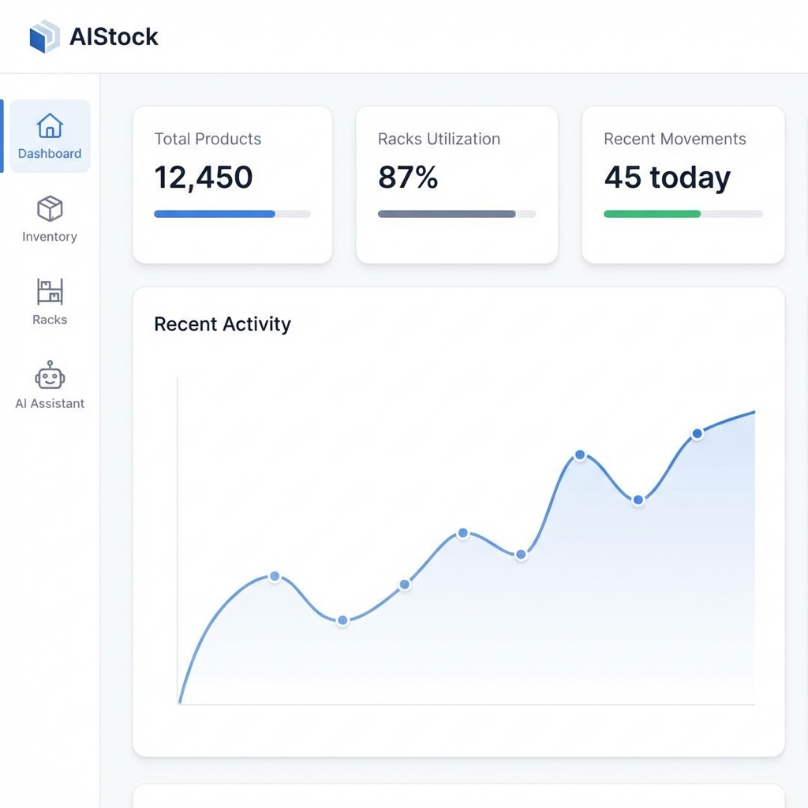
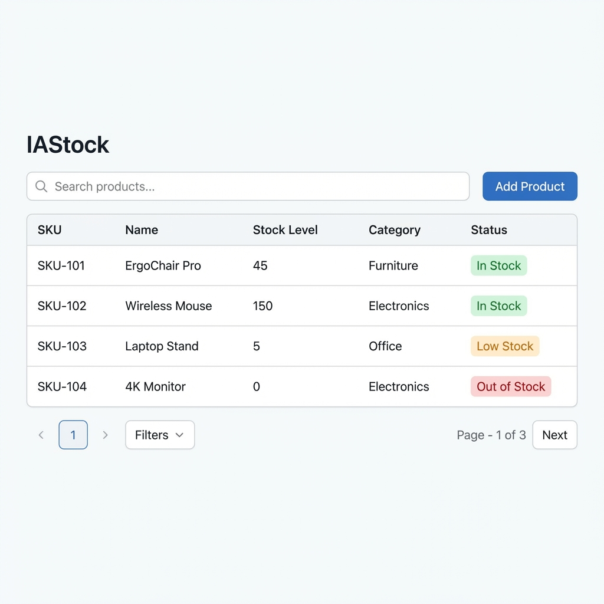
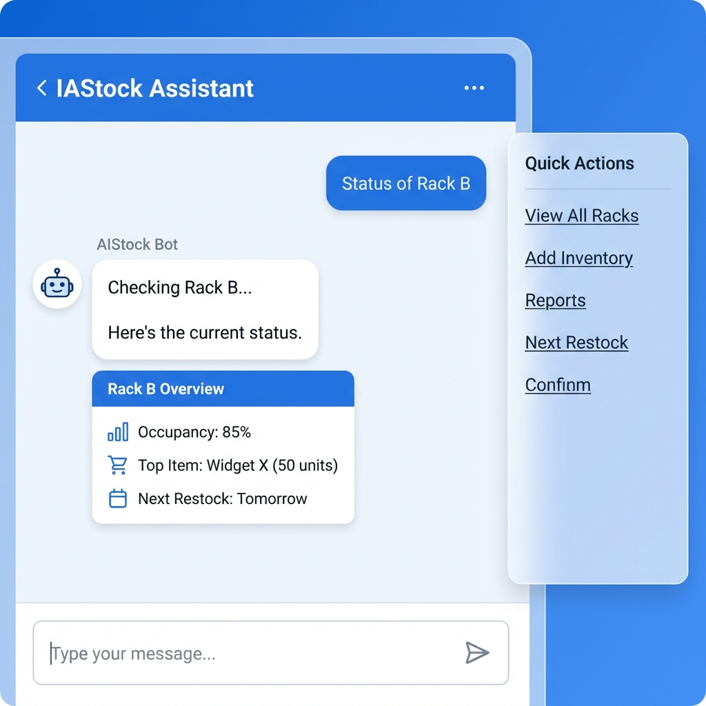
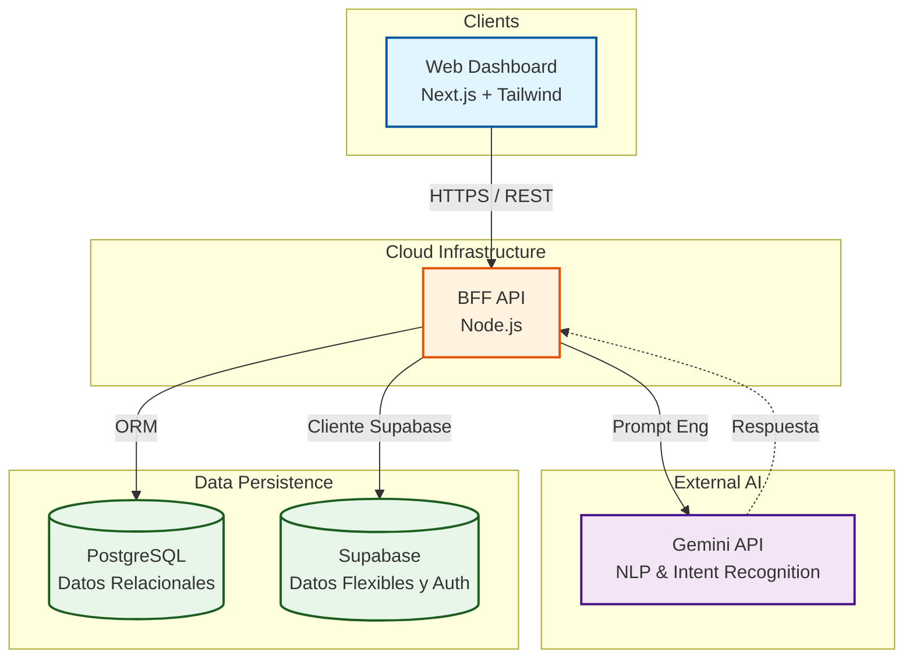
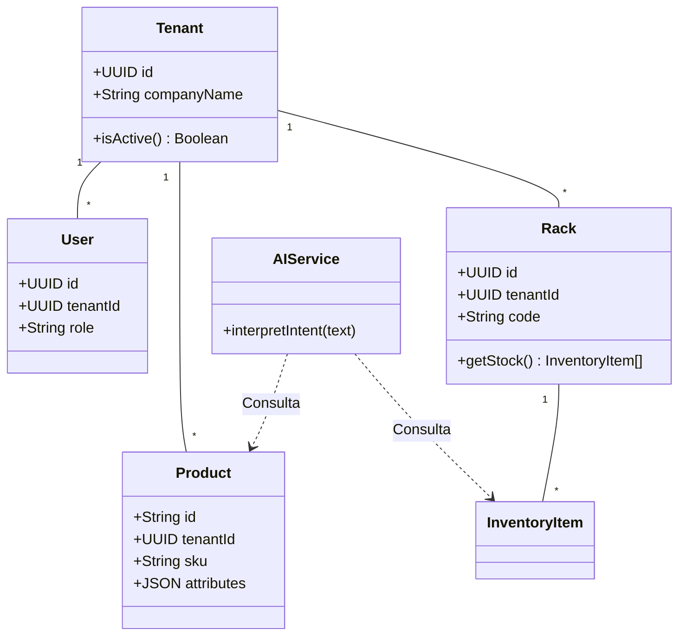
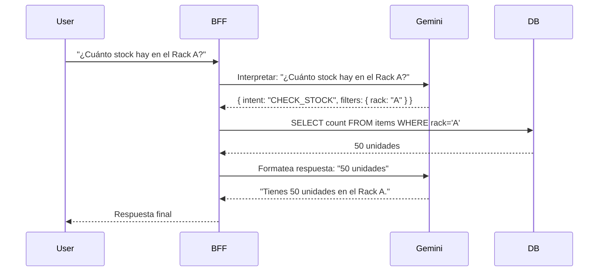

# Documentación Técnica: IAStock

## 1. Historias de Usuario y Mockups

**Actores del Sistema:**

- **Gerente de Almacén:** Responsable de la visión general, gestión de racks y usuarios.
- **Operario:** Responsable del movimiento físico de stock y consultas rápidas.

**Historias de Usuario (Priorizadas):**

1.  **Como Operario**, quiero poder preguntar al sistema "¿Dónde está el Producto X?" usando lenguaje natural para no perder tiempo navegando menús.
2.  **Como Gerente**, quiero que cada cliente tenga sus datos aislados (Multi-tenant) para asegurar la privacidad.
3.  **Como Operario**, quiero mover stock escaneando un código y confirmando la cantidad para mantener el inventario al día.
4.  **Como Gerente**, quiero crear productos con atributos personalizados (ej: Talla, Color, Voltaje) ya que mi inventario es variado.

### 🖼️ UI Mockups

**Dashboard**

_Vista general con métricas clave y gráficos de actividad reciente._

**Catálogo de Productos**

_Tabla de datos para la gestión de inventario con búsqueda y estados._

**Asistente IA**

_Interfaz de chat para consultas de stock y respuestas en lenguaje natural._

---

## 2. Arquitectura del Sistema

El sistema sigue una arquitectura basada en **Backend for Frontend (BFF)** con servicios en la nube.

---

## 3. Componentes, Clases y Diseño de Datos

### Diagrama de Clases (Lógica de Backend)

Representa las entidades principales manejadas por el BFF.

### Diseño de Base de Datos

- **PostgreSQL (Relacional):** Maneja la integridad estricta. Tablas: `Tenants`, `Users`, `Racks`, `InventoryItems`.
- **Supabase (Documental/Flexible):** Se utiliza su capacidad de manejar columnas JSONB para almacenar los atributos flexibles de los `Products`.

---

## 4. Diagramas de Secuencia

### Consulta con IA (Chatbot)

El usuario pregunta en lenguaje natural, el BFF usa Gemini para entender la intención y luego consulta la base de datos.

---

## 5. Especificaciones de API

### APIs Externas

- **Google Gemini API:** Procesamiento de Lenguaje Natural.
- **Supabase Client:** Gestión de base de datos y autenticación.

### APIs Internas (BFF)

| Método | Endpoint                  | Descripción                      | Formato Input                  |
| :----- | :------------------------ | :------------------------------- | :----------------------------- |
| `POST` | `/api/v1/ai/chat`         | Interacción con el asistente IA. | `{ "message": "..." }`         |
| `GET`  | `/api/v1/inventory/racks` | Obtener estado de racks.         | Query Params                   |
| `POST` | `/api/v1/products`        | Crear producto nuevo.            | JSON (con atributos flexibles) |

---

## 6. Planes de SCM y QA

**Source Control Management (SCM):**

- **Git Flow Simplificado:** Ramas `feature/*` que se fusionan a `main` mediante Pull Requests.
- **Convenciones:** Commits semánticos (ej: `feat:`, `fix:`, `docs:`).

**Quality Assurance (QA):**

- **Unit Testing:** Tests unitarios para utilidades lógicas del Backend.
- **Integration Testing:** Verificar que el BFF se comunique correctamente con Supabase y Gemini.
- **Manual Testing:** Validación de flujos de usuario (User Stories) antes de cada entrega.

---

## 7. Justificaciones Técnicas

- **Next.js:** Elegido por su rapidez para construir paneles administrativos interactivos con React y su capacidad de renderizado híbrido.
- **Node.js (BFF):** Para compartir lógica (tipos, validaciones) con el frontend ya que usamos Next.js, maneja bien la concurrencia para llamar a las APIs externas.
- **Supabase:** Simplifica la infraestructura al tener base de datos, autenticación y almacenamiento en tiempo real en una sola plataforma, vital para un MVP rápido.
- **Gemini AI:** Ofrece un balance excelente entre capacidad de entendimiento de contexto y costo/latencia para un asistente de inventario.
