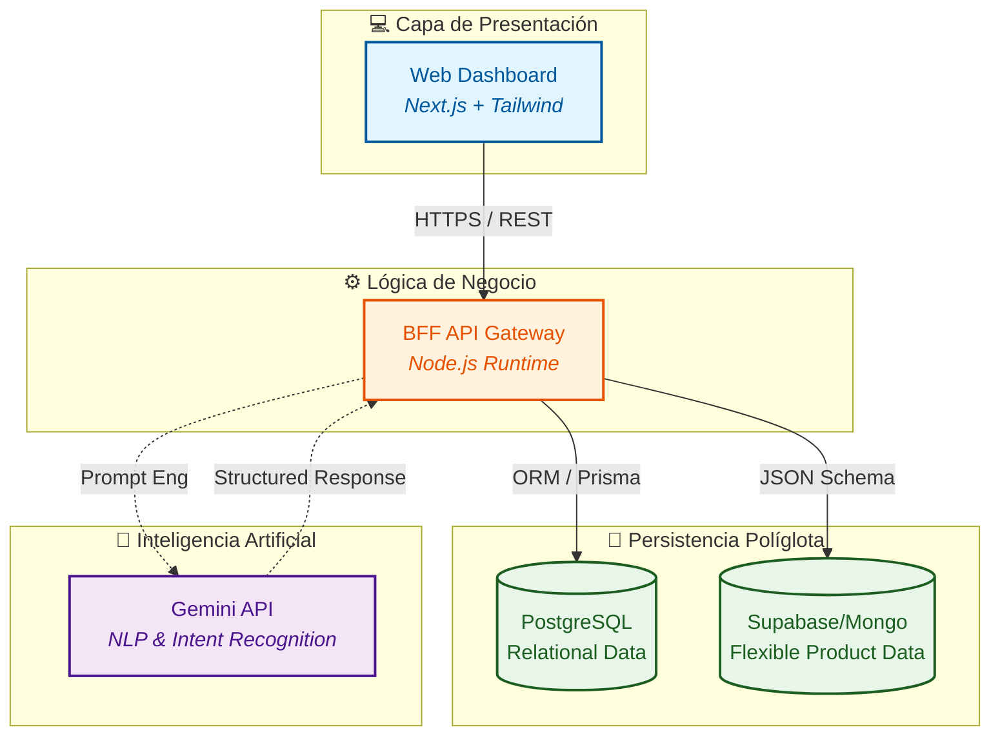
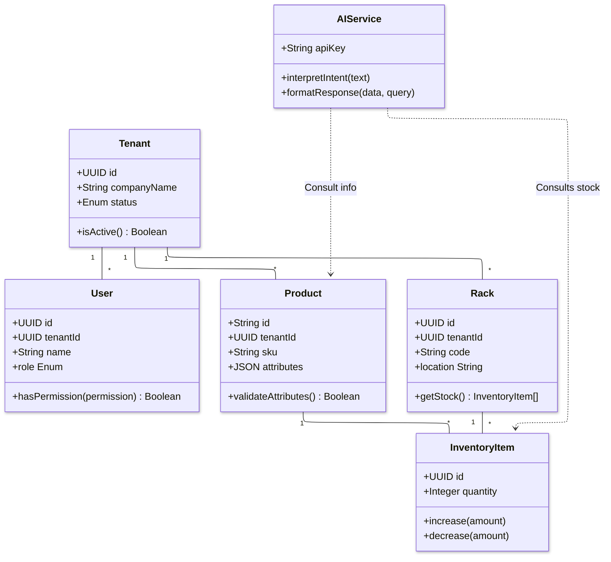
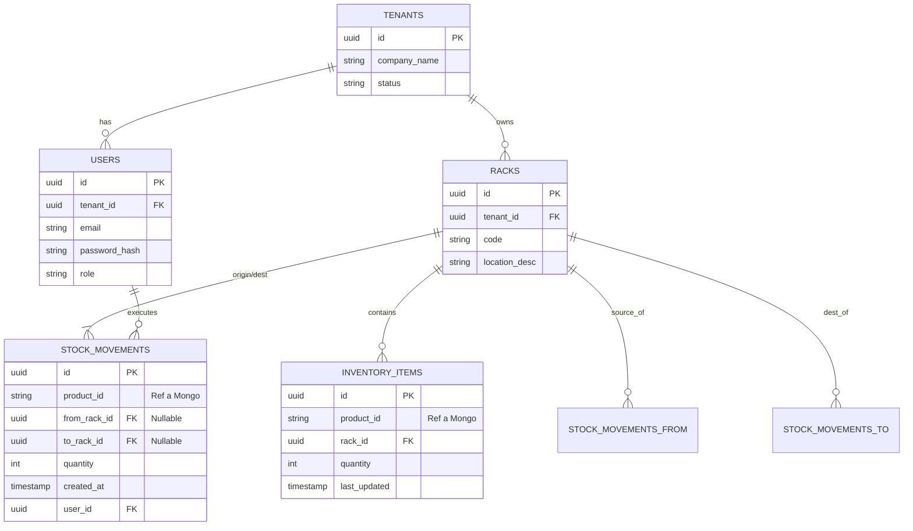
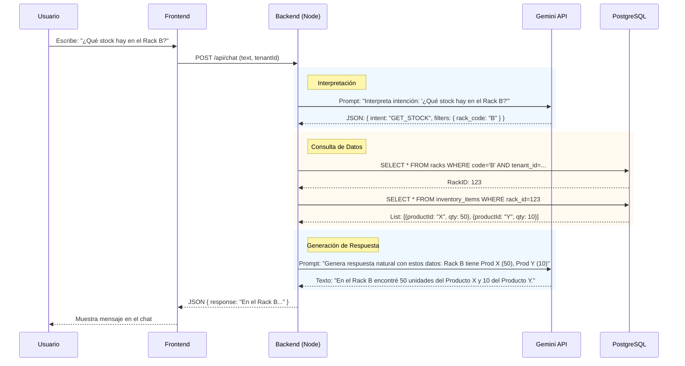
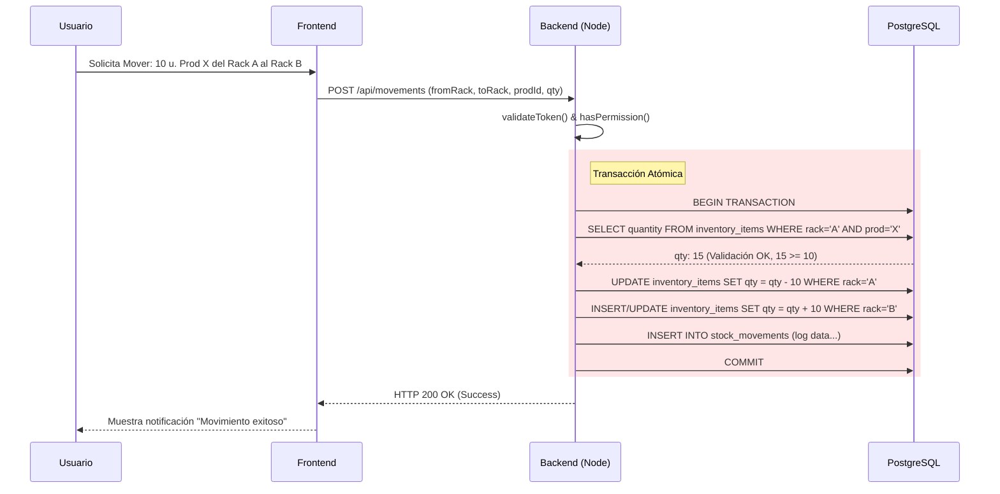
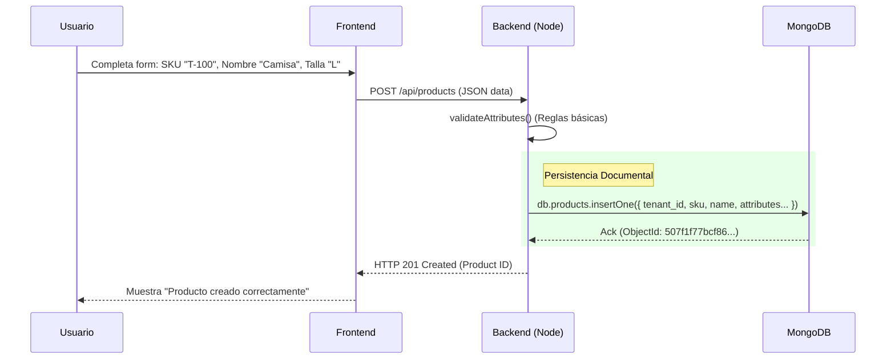

# Documentación Técnica del Proyecto: AIStock

Este documento detalla la arquitectura, el diseño de datos y las estrategias de desarrollo del MVP de **AIStock**.

---

#### 📄 0. User Stories and Mockups

### Actores del Sistema
* **Gerente de Depósito:** Supervisión global, análisis de racks y movimientos entre depósitos.
* **Usuario Normal:** Gestión de stock personal, registro de entradas/salidas y consultas rápidas.

### User Stories (MoSCoW)
* **Must Have:** * Interacción por **texto** con Chatbot (estilo Alexa) para estadísticas.
    * Aislamiento de datos por cliente (**Multi-tenant**).
    * Control de stock por Racks y Estanterías.
* **Won't Have (Out of Scope):** * Entrenamiento automático de modelos desde la app.
    * Predicciones de compra automáticas.

---

#### 📄 1. Design System Architecture

# 🏛️ Arquitectura del Ecosistema

Este sistema utiliza un patrón de diseño **BFF (Backend for Frontend)** con una estrategia de **Persistencia Políglota**, separando las responsabilidades en capas especializadas.

### 🖼️ Diagrama de Infraestructura


---

### 🛠️ Desglose de la Infraestructura

#### 🎨 Capa de Cliente (Presentación)
 
* **Frontend:** Dashboard interactivo construido con **Next.js**.
* **Comunicación:** Intercambio de datos mediante **HTTPS/REST**, optimizado para tiempos de respuesta bajos y una interfaz reactiva.

#### 🧠 Lógica de Negocio (BFF Layer)
 
* **Backend for Frontend (BFF):** Actúa como orquestador único, centralizando la seguridad y la lógica de negocio.
* **Aislamiento:** Garantiza que cada consulta respete los límites del **Multi-tenancy** mediante validación estricta de `tenant_id`.

#### 💾 Persistencia de Datos Híbrida
El sistema separa la información según su naturaleza para maximizar la eficiencia:

| Almacenamiento | Tecnología | Datos Gestionados |
| :--- | :--- | :--- |
| **Relacional** | `PostgreSQL` | Usuarios, permisos, racks y trazabilidad de stock. |
| **Documental** | `Supabase` | Catálogo de productos con atributos flexibles y esquemas variables. |

#### 🤖 Inteligencia Artificial (NLP)

* **Motor Cognitivo:** Utiliza **Gemini API** para la interpretación de intenciones (*Intent Recognition*).
* **Procesamiento:** Traduce las peticiones en lenguaje natural del usuario a parámetros de consulta técnicos y viceversa.

> [!NOTE]
> **Flujo de Ejecución:** El BFF coordina la entrada del usuario, solicita la interpretación a la IA, consulta las bases de datos correspondientes y devuelve una respuesta estructurada y humanizada.

---
---

#### 📄 Tarea 2 — Componentes, Clases y Diseño de Base de Datos
* **2.1** Componentes del Sistema
    El sistema utiliza una arquitectura de Backend for Frontend (BFF) con persistencia políglota.

    **Frontend** (Mobile - Flutter & Desktop - Next.js):

    **Responsabilidad:** Capa de presentación.

    **Mobile:** Enfocado en operarios (escaneo, movimientos rápidos, consulta en planta).

    **Desktop:** Enfocado en administradores (gestión de racks, ABM de productos, dashboard).

    **Interacción:** Se comunica exclusivamente con el Backend (Node.js) vía REST/JSON. No accede a la BD ni a la IA directamente.

    * **Backend (Node.js):**

    **Responsabilidad:** Orquestador de lógica de negocio, autenticación, autorización y validación. Actúa como intermediario entre el usuario, los datos y la inteligencia artificial.

    **Interacción:** Recibe peticiones del Frontend. Consulta PostgreSQL para datos relacionales y MongoDB para fichas de productos. Invoca a la API de Gemini para procesamiento de texto.

    **Agente** de IA (Gemini API):

    **Responsabilidad:** Procesamiento de Lenguaje Natural (NLP).

    **Funciones:**

    Input: Interpretar la intención del usuario (ej: "mover stock") y extraer entidades (ej: "Rack A", "Producto X").

    Output: Generar respuestas en lenguaje natural basadas en los datos estructurados que le provee el backend.

    Restricción: No almacena contexto a largo plazo ni entrena modelos.

    **Base de Datos Relacional (PostgreSQL):**

    Responsabilidad: Integridad referencial y datos estructurados. Almacena Tenants, Usuarios, Racks, Conteos de Inventario (IDs y cantidades) y Logs de movimientos.

    **Base de Datos Documental (MongoDB):**

    Responsabilidad: Flexibilidad de esquema. Almacena la información descriptiva de los Productos. Dado que cada tenant puede vender cosas distintas (ej: uno vende ropa con "talla/color", otro vende electrónica con "voltaje/potencia"), se requiere un esquema flexible.


# 📂2.2 Clases del Backend (Descripción UML)

A continuación, se definen las clases principales que residen en la capa de lógica del Backend (**Node.js**).

> [!IMPORTANT]
> **Nota de Implementación:** Todos los métodos asumen manejo asíncrono (**Promises / Async-Await**).

---

### 📊 Diagrama de Clases General
Visualización de las entidades y sus métodos principales:




#### 📄 2.3 Diseño de Base de Datos
A. Base de Datos Relacional — PostgreSQL (ERD)
Este diagrama representa la estructura rígida para manejar la ubicación y cantidad del inventario, asegurando consistencia transaccional.
.



---

## 💾 B. Base de Datos Documental — MongoDB

Se utiliza para almacenar la información descriptiva de los productos, permitiendo que cada **Tenant** defina sus propios atributos sin afectar la estructura global.

### 📁 Colección: `products`

Esta colección maneja un esquema híbrido: campos fijos para integridad del sistema y un objeto flexible para datos comerciales.

#### 📄 Estructura del Documento (Ejemplo)

```json
{
  "_id": "64b8f...scan", 
  "tenant_id": "uuid-del-tenant-postgresql",
  "sku": "PROD-001",
  "name": "Zapatilla Running X",
  "description": "Zapatilla de alto rendimiento",
  "attributes": {
      "size": 42,
      "color": "Rojo",
      "material": "Sintético",
      "batch_number": "L-2024"
  },
  "created_at": "2024-01-20T10:00:00Z"
}
```
* Campos Obligatorios: _id, tenant_id (para aislamiento), sku, name.

* Campos Opcionales/Flexibles: Todo lo contenido dentro del objeto attributes.

#### 📄 2.4 Frontend — Componentes UI
* Login: Formulario simple (Email/Pass). Al loguearse, el backend determina el tenant_id del usuario y carga la configuración correspondiente.

* Dashboard: Vista resumen. Muestra métricas simples (Total de productos, Racks casi llenos, últimos movimientos). Sin predicciones.

* Gestión de Productos (Catalog): Tabla con buscador. Permite crear/editar productos (Define el JSON que va a Mongo).

* Gestión de Racks: Vista de lista o grilla de ubicaciones físicas. Permite ver el contenido actual de un rack.

* Movimientos de Stock: Interfaz transaccional. Selectores: "Desde Rack A" -> "Hacia Rack B" -> "Producto" -> "Cantidad". Botón de confirmar.

* **Chatbot Assistant:**

        UI: Botón flotante o panel lateral.

        Input: Campo de texto libre.

        Output: Burbujas de chat. Muestra texto plano ("Hay 5 unidades...") y, si corresponde, tarjetas de datos simples (mini tabla de resultados).

---

## 3. Sequence Diagram (Resumen de Proceso)

Secuencia 1 — Consulta de Stock por Chatbot
Caso: Usuario pregunta "¿Qué stock hay en el Rack B?". Nota: El Backend actúa como puente. Gemini solo "entiende" y luego "redacta", no consulta la DB.




Secuencia 2 — Movimiento de Stock
Caso: Mover mercancía físicamente de un lugar a otro.




Secuencia 3 — Creación de Producto
Caso: Alta de un nuevo producto con atributos flexibles (MongoDB).



---

## 4. API Specifications

* **External:** Google Gemini API (Análisis y Chatbot).
* **Internal POST `/api/v1/ai/chat`**: Punto de entrada para el agente de texto.
* **Internal GET `/api/v1/inventory/racks`**: Estado de los racks en tiempo real.

---

## 5. SCM and QA Strategies

### Estrategia de Código
* **Repositorio:** GitHub.
* **Branching:** GitHub Flow. Se requiere revisión de código antes de cualquier integración a `main`.
* **Editor:** Compatible 100% con Visual Studio Code.

### Estrategia de Calidad
* **Aislamiento (Security):** Verificación de que los contenedores de Cloud Run no compartan datos entre clientes.
* **IA Testing:** Validación de las respuestas del modelo LSTM sobre datos históricos.

---

## 6. Technical Justifications

* **LSTM:** Elegido por su capacidad de procesar secuencias y considerar eventos pasados para el análisis de inventario.
* **Multi-tenancy:** Implementado para cumplir con la seguridad empresarial, asegurando que cada cliente es dueño de su información.
* **MongoDB:** Justificado por la heterogeneidad de los productos que los clientes pueden registrar.
